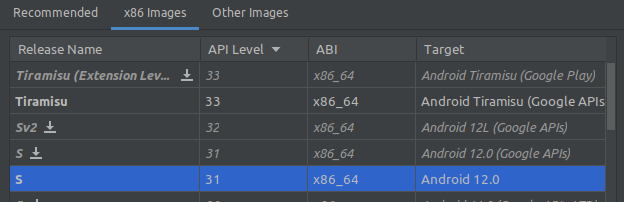

# Reverse-engineering using AVD
This guide describes the development process using the Android Virtual Device. This method does not require a rooted physical Android device and also can be used remotely using VPN.

## Prerequisites
1. Inverter is connected to your network and reachable at the IP 10.10.100.254 (important). See Appendix A.
2. Android Studio installed. See [official page](https://developer.android.com/studio).

## Installing the AVD
Create a new Android virtual device. The model should not matter (I use the default Pixel 3a). See the [official guide](https://developer.android.com/studio/run/managing-avds). When choosing the system image, choose the one without Google APIs, this image has root access enabled:

## Installing the Sermatec app
1. Get the apk file. It is available e.g. on the [APKPure store](https://apkpure.com/sermatec/com.sermatec.inverter). If the current version is available only in the xapk format, see Appendix B.
2. Install the app. Open your shell (bash, cmd...) and type `adb install <path_to_apk>`.

## Connecting the Wireshark
TODO

## Appendix
### A: Connecting the inverter to your network.
The official application has a hard-coded IP 10.10.100.254, which is a fixed IP address of the inverter in the local connection mode. This mode is unpractical because it forces you to stand next to the inverter to have a reliable connection. This chapter describes how to trick the app to think you are connected directly to the inverter even though you might be located 400 km away and connected via the VPN.

First things first. The inverter's WiFi module works in two modes - station and AP mode - which could be enabled simultaneously.

#### AP mode
In the access point (AP) mode, the device itself creates a WiFi access point to which you can connect. This mode is used in the official app by the dealers to set up the device and also can be used by the end-users to check the parameters locally when the Sermatec cloud is offline. Using a little trick, however, we can use this mode to bridge the inverter to the local network. This method requires that you have a router that has a wireless client mode. The generic process looks like the following:
1. Connect the router to the inverter's AP - the router's interface will receive an IP from the inverter's built-in DHCP server.
2. Create a NAT masquerade rule. This rule should be applied when the out interface is the one you used to connect to the inverter. This step is required because the inverter expects that the source IP is from the local pool (10.10.100.xxx).

#### Station mode
In the station mode, the device connects to the wireless AP like standard user devices (smartphones, laptops...) and it is a standard mode to be used:
1. Create a (virtual) AP on your router.
2. Create a new DHCP server and assign the pool 10.10.100.0/24.
3. Reserve the IP 10.10.100.254 for the inverter.
4. Create a NAT masquerade rule. This rule should be applied when the out interface is the virtual AP you created in step 1.

### B: Unpacking the XAPK file.
The xapk file is a ZIP archive, unpack it with your favorite software and extract the com.sermatec.inverter.apk file. This file is the app installer and could be used in the next steps.