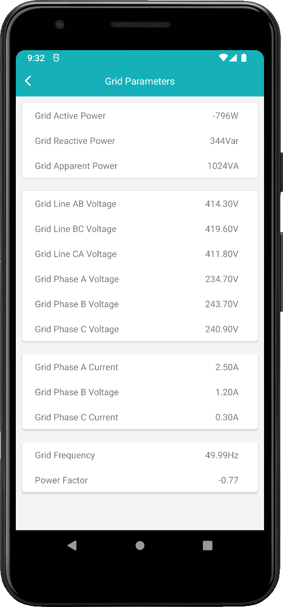
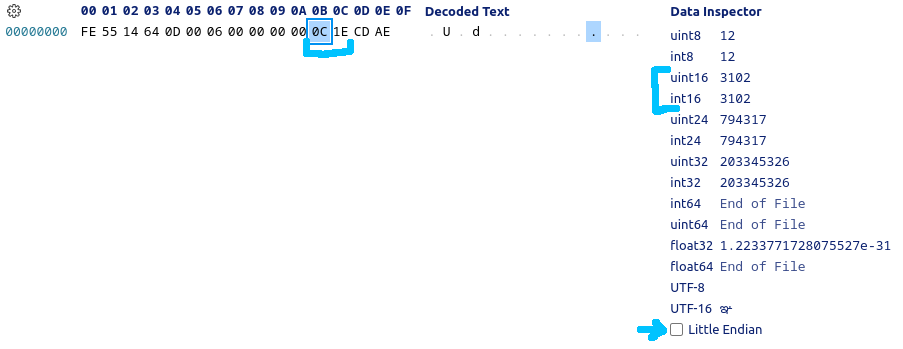

# Data inspection
This guide aims to describe the process of decoding and inspecting the data coming to and from the inverter. You should already have prepared your development device (physical or virtual) and Wireshark started. If not, check other guides in the documentation.

The process is essentially looking for values read from the app in the dump of packets in the Wireshark. Therefore it consists of two parts - reading the values and inspecting the packets.

## Reading the values
Open the Sermatec app, and select a Local Connection Mode. Connect to the inverter, pick a section you want to decode in the protocol, and expand the section. Take a screenshot and stop the capture in Wireshark. You have to be quick because the refresh rate is high (new data every ~5s), otherwise you will need to inspect a lot of packets. Now it's time to inspect the captured packets and compare the data to the values in the screenshot.

## Inspecting the packets
Now we have a couple of packets. To eliminate irrelevant ones, use this Wireshark filter: `ip.addr == 10.10.100.254 && tcp.flags.push == 1`. Inverter's default IP in the Local Connection Mode is `10.10.100.254`. This could be verified in the UART-TCP module settings available at the inverter's LAN IP at port 80. Check out the README.md for more information.

After filtering out the irrelevant packets, we can search for our values. Because the structure of the protocol is already known, it is easy to find packets containing new commands (and responses). For example, I chose the command `0x000d`, found the response (source is `10.10.100.254`), and exported data (right-click on the Data row in the packet inspector) to my hex editor. I recommend the Hex Editor addon for VS Code.

The response looks like the following:

Because we know that the integers are usually 2-byte and big-endian, we can go through the payload and check the data inspector (or convert the values manually if your hex editor doesn't support the feature) for our values in the screenshot. In the example above, I found out that the household load is contained in the response for the command `0x000d` at the address `0x0b`. Because appliances will never generate power (therefore there is no need for negative values), I can assume the value is unsigned - uint16_t data type (unsigned 2-byte integer).

## Conclusion
After finding out the command number and the data address in the response, it is required to find the appropriate request: just find the packet with the corresponding command number sent from the app to the inverter and copy the data.

After that, it is only a matter of adding a new function or extending the existing one. Do not forget to document your findings in the [PROTOCOL.md](PROTOCOL.md) file.