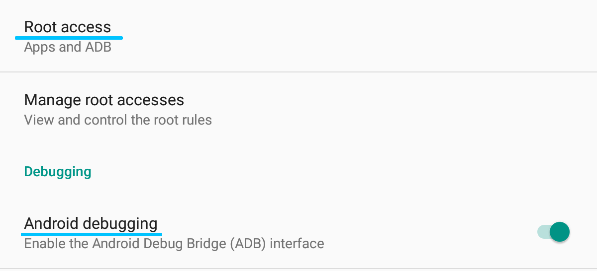

# Development guide
This guide aims to demonstrate a basic reverse-engineering workflow.

## Requirements
- An Android smartphone or tablet that has been rooted and has the tcpdump and Sermatec apps installed,
- adb,
- Wireshark,
- A hex editor (optional for faster data inspection).
- Sermatec inverter (obviously).

## Workflow
### Preparation
Firstly, you will need to root your Android device. Without root, you won't be able to access the adb shell with the required privileges. After that, allow debugging and adb root access in the developer options. Don't forget that the options are usually hidden and you need to enable them (usually by tapping the build number in the `About phone` menu several times; consult your Android version manual).

Now you should be able to start an adb session in your computer's terminal as root: `adb root`.

### Getting the Data
We will dump the devices' traffic with tcpdump and pipe it to the computer's Wireshark.

Open the terminal and prepare the following command: `adb shell "tcpdump -vv -i any -Uw - 2>/dev/null" | wireshark -kSi -`. 
Note: You need to have `tcpdump` and `adb` included in your $PATH, or use the full path to the respective executables instead.

When you are ready, execute the command and continue with the [data inspection guide](RE_DATA_INSPECTION.md).